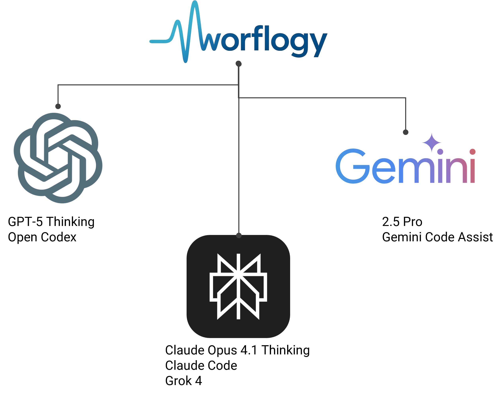

# 스타트업-데이트 연구노트

[**워플로지 홈으로 돌아가기**](https://worflogy.com)

---

> **스타트업-데이트 실험 환경**

---

- 2025.09.15

> 미국 Founders Institute에서 운영하는 Korea·Japan 프로그램 참여에 대한 토론
> - (내용 정리 중)

> 리스크 관리의 글로벌 표준화 커뮤니티 중 하나인 영국 IRM의 새로운 거버넌스 후보에 대한 토론
> - (내용 정리 중)

---

- 2025.07.27 ~ 2025.09.05

> SaaS 솔루션 검증을 위한 오프라인 밸류 컨설팅 활용 방향 및 전략에 대한 토론
> - (내용 정리 중)

> 솔루션의 적용 도메인 영역에 대한 기업의 기술 비전 정합성 검증 토론
> - (내용 정리 중)

> 오프라인 컨설팅 서비스의 고객 가치와 보상의 적정성에 대한 토론
> - (내용 정리 중)

---

